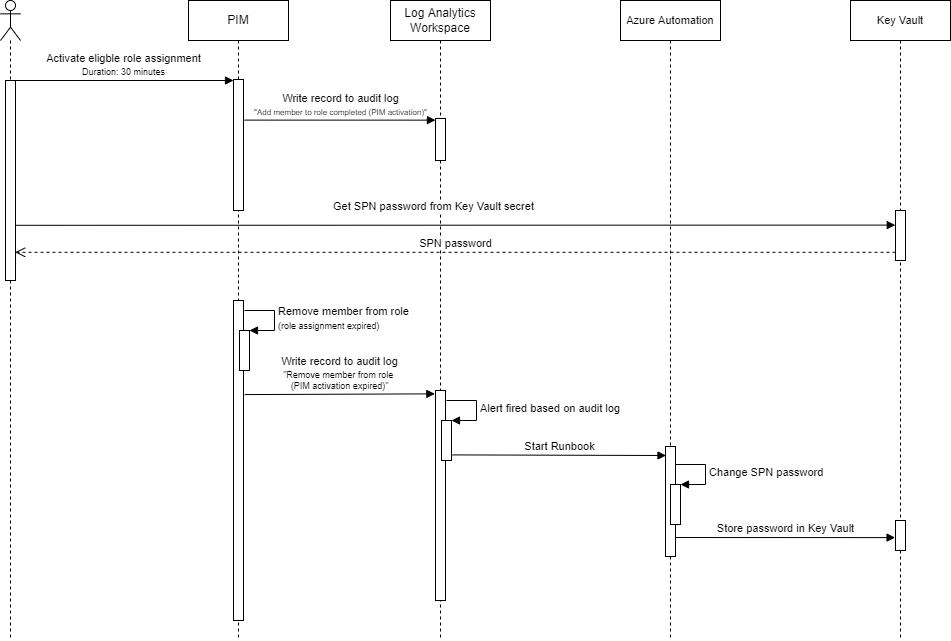

# Rotate service principal password

In this repository, I demonstrate how you can rotate the password of a service principal using PIM and Azure automation. You can find the related [blog post here](https://www.patrickvankleef.com/2022/11/09/rotate-service-principal-password).